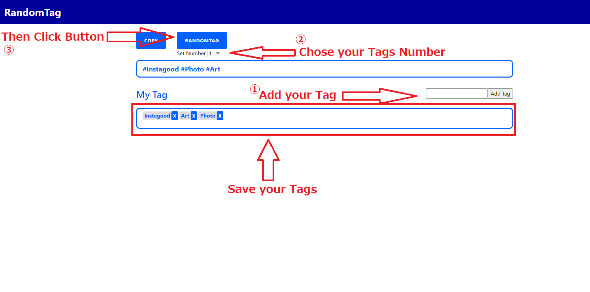

# Randomtag

"Randomtag" is a web service that people can make favorite hashtags.
You can save your favorite hashtags and make them randomly.
Use for marketing.
Especially, on Instagram, you will be shadowbanned if you post the same hashtags every day.
This application helps you to prevent it.

# Requirement

clipboard.js

# Installation

ruby 2.5.3p105 (2018-10-18 revision 65156)
Rails 5.2.4.3
jQuery
Clipboard.js

# Usage

Put your hashtags and click "add".
You can save hashtags.
After that, choose tags numbers and click random button and copy.

# Author

* Akinori Toma
* ignitoma_1031@yahoo.co.jp

# License

"Randomtag" is under [Akinori Toma license].

Enjoy making your tags!
